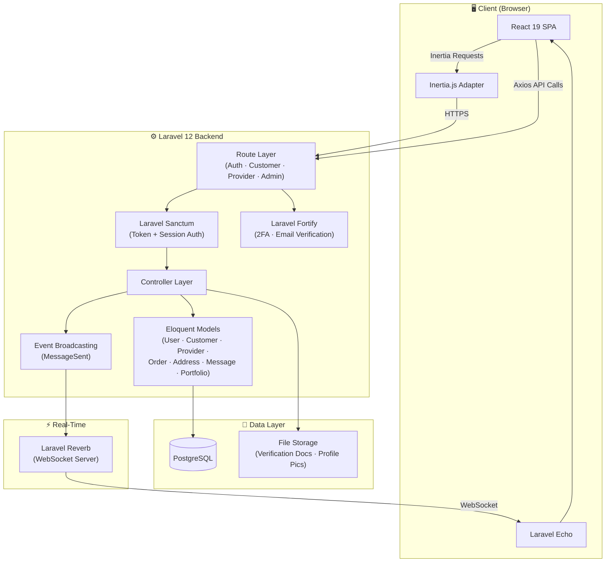
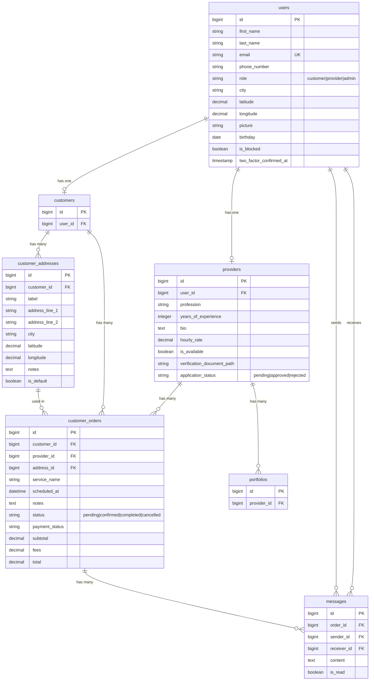

<p align="center">
  
</p>

<h1 align="center">🛠️ Hirfati (حرفتي)</h1>

<p align="center">
  <b>Libya's Premier Home Services Marketplace</b><br>
  <i>Find trusted craftsmen. Get the job done. No hassle.</i>
</p>

<p align="center">
  <a href="https://laravel.com"></a>
  <a href="https://react.dev"></a>
  <a href="https://inertiajs.com"></a>
  <a href="https://tailwindcss.com"></a>
  <a href="https://www.postgresql.org"></a>
  <a href="#"></a>
</p>

<p align="center">
  <a href="#-overview">Overview</a> •
  <a href="#-screenshots">Screenshots</a> •
  <a href="#-feature-deep-dive">Features</a> •
  <a href="#-tech-stack">Stack</a> •
  <a href="#-architecture">Architecture</a> •
  <a href="#-project-structure">Structure</a> •
  <a href="#-api-reference">API</a> •
  <a href="#-getting-started">Setup</a>
</p>

---

## 📖 Overview

**Hirfati** (`حرفتي` — "My Craft") is a full-stack, multi-vendor marketplace that connects Libyan homeowners with **verified** local service professionals — plumbers, electricians, painters, carpenters, and more.

The platform handles everything end-to-end: **finding a pro → placing an order → real-time chat → service delivery → payment tracking**. It ships with three distinct dashboards (Client, Worker, Admin), a vibrant 3D-animated landing page, and a real-time messaging layer powered by WebSockets.

**Core pillars:** `Speed` · `Trust` · `User Experience`

---

## 📸 Screenshots

<div align="center">
<table>
  <tr>
    <td align="center" colspan="2"><b>🏠 Marketplace Landing Page</b></td>
  </tr>
  <tr>
    <td align="center" colspan="2"></td>
  </tr>
  <tr>
    <td align="center"><b>📊 Client Dashboard</b></td>
    <td align="center"><b>💬 Real-Time Chat</b></td>
  </tr>
  <tr>
    <td></td>
    <td></td>
  </tr>
  <tr>
    <td align="center"><b>👤 Profile Page</b></td>
    <td align="center"><b>✏️ Profile Editor</b></td>
  </tr>
  <tr>
    <td></td>
    <td></td>
  </tr>
  <tr>
    <td align="center" colspan="2"><b>📦 My Orders Dashboard</b></td>
  </tr>
  <tr>
    <td align="center" colspan="2"></td>
  </tr>
</table>
</div>

---

## ✨ Feature Deep-Dive

### 🔐 Authentication & Security

| Feature | Details |
|:---|:---|
| **Multi-Role System** | Three distinct roles — `customer`, `provider`, `admin` — each with dedicated dashboards and permissions |
| **Token-Based Auth** | Laravel Sanctum with API token + session dual-authentication |
| **OTP Email Verification** | 6-digit code verification on registration and password reset (not magic links!) |
| **Two-Factor Auth (2FA)** | TOTP-based 2FA via Laravel Fortify with recovery codes |
| **Rate-Limited Endpoints** | Custom throttle middleware on login, register, password reset, and profile update routes |
| **Account Blocking** | Admin can block/unblock any user via the `is_blocked` flag |
| **Secure Logout** | Revokes all Sanctum tokens + destroys web session in a single call |

### 👷 Provider Application Lifecycle

| Status | What Happens |
|:---|:---|
| `pending` | Provider submits application with profession, experience, bio, hourly rate, and a verification document (ID/certificate upload) |
| `approved` | Admin reviews and approves → provider gains full platform access |
| `rejected` | Admin rejects with reason → provider sees a rejection page and can **resubmit** with updated documents |

> The entire flow has dedicated pages: `Onboarding.tsx` → `pending-approval.tsx` → `rejected-approval.tsx` + the admin review panel.

### 📦 Order Lifecycle Management

```
┌─────────┐     ┌────────────┐     ┌────────────┐     ┌───────────┐
│ pending  │ ──► │ confirmed  │ ──► │ completed  │ ──► │   paid    │
└─────────┘     └────────────┘     └────────────┘     └───────────┘
      │                                                      
      └──────────────────► cancelled                         
```

Each order tracks:
- **Service info:** `service_name`, `scheduled_at`, `notes`
- **Financials:** `subtotal`, `fees`, `total` (stored as `decimal:2`)
- **Payment status:** Independent `payment_status` field
- **Linked entities:** Customer, Provider, Address, and all chat Messages

The client can **create**, **view**, **list**, and **cancel** orders from their dashboard. Each order detail page shows the full context + an embedded real-time chat thread.

### 💬 Real-Time Chat (WebSockets)

Built on **Laravel Reverb** for native PHP WebSocket support — no third-party services needed.

- **Order-scoped conversations:** Each chat thread is tied to a specific `CustomerOrder`
- **Bi-directional messaging:** Both client and provider see the same thread, with sender/receiver roles
- **Instant delivery:** `MessageSent` event broadcasts via Reverb, picked up by **Laravel Echo** on the frontend
- **Read tracking:** `is_read` boolean per message for future notification badges
- **Dual views:** Separate message pages for clients (`client/Messages.tsx`) and workers (`worker/Messages.tsx`), each accessing the same `MessageController` through role-specific routes

### 🏠 Customer Address Book

Full CRUD address management with geolocation:

- **Fields:** `label`, `address_line_1`, `address_line_2`, `city`, `latitude`, `longitude`, `notes`
- **Default address:** One address can be marked as `is_default` (auto-deselects others)
- **Dedicated pages:** `AddressCreate.tsx` and `AddressEdit.tsx` with form validation
- **Order integration:** Orders reference a customer's saved address via `address_id`

### 🎨 Marketplace Landing Page

The public-facing landing page (`welcome.tsx` — **76KB** of rich UI) features:

- **3D Floating Tools Scene** — Animated craftsman tools rendered with `@react-three/fiber` + `@react-three/drei`
- **Floating geometric shapes** — Ambient animated backgrounds via `FloatingShapes.tsx`
- **Hero section** with gradient text and call-to-action buttons
- **Category showcase** — Grid of service categories
- **Featured professionals** — Provider cards with ratings and specializations
- **Fully responsive** — Mobile-first design with Tailwind v4
- **Custom CSS** — `marketplace.css` (39KB) of handcrafted styles and animations

### 🔎 Provider Discovery

- **Provider Listing** (`ListingPage.tsx`) — Browse and search all approved professionals
- **Provider Profile** (`ProviderProfile.tsx`) — Full profile view with bio, hourly rate, experience, portfolio items, and reviews
- **Find Pros** (`client/FindPros.tsx`) — Client-side provider search and discovery with filtering

### 👤 User Profile Management

- **Comprehensive profile editor** (`client/Profile.tsx` — 46KB) with fields for:
  - First name, last name, email, phone number
  - Profile picture upload with live preview
  - Birthday picker
  - City and location
- **Backend validation** via `UpdateClientInfoRequest` with `sometimes` rules (partial updates supported)
- **Secure endpoint:** `PUT /api/client/profile/update` with rate limiting

### 🛡️ Admin Panel

- **Craftsmen Management** (`admin/craftsmen.tsx`) — List all pending provider applications
- **Detailed Review** (`admin/craftsman-detail.tsx`) — View full application including uploaded verification documents
- **Document Download** — Admins can access provider verification documents via `GET /admin/craftsmen/{id}/document`
- **One-click actions:** Approve or reject providers with `PATCH` endpoints

---

## 🛠 Tech Stack

| Layer | Technologies |
|:---|:---|
| **Runtime** | PHP 8.2+, Node.js |
| **Backend Framework** | Laravel 12, Laravel Fortify (2FA), Laravel Sanctum (API auth) |
| **Frontend Framework** | React 19, Inertia.js 2.x (SPA without an API layer for pages) |
| **Styling** | Tailwind CSS 4.0, Custom CSS, `tw-animate-css` |
| **UI Components** | Shadcn UI (built on Radix UI primitives), Headless UI, Lucide React icons |
| **3D Graphics** | Three.js via `@react-three/fiber` + `@react-three/drei` |
| **Real-Time** | Laravel Reverb (WebSocket server), Laravel Echo (client), Pusher.js (protocol) |
| **Animations** | Framer Motion |
| **Forms** | React Hook Form, Zod validation |
| **Charts** | Recharts |
| **Database** | PostgreSQL 16 |
| **Routing (JS)** | Ziggy (Laravel named routes in JS), Wayfinder |
| **Build Tool** | Vite 7 with `@vitejs/plugin-react` |
| **Code Quality** | ESLint 9, Prettier, TypeScript strict mode |
| **Testing** | Pest PHP |

---

## 🏗 Architecture



### Request Flow

```
Browser → Inertia.js (page navigation) ─┐
Browser → Axios (API calls) ────────────┤
                                         ▼
                               Laravel Routes (web.php + api routes)
                                         │
                              ┌──────────┼──────────┐
                              ▼          ▼          ▼
                          Auth MW    Role MW    Throttle MW
                              │          │          │
                              └──────────┼──────────┘
                                         ▼
                                   Controllers
                                    │       │
                              ┌─────┘       └─────┐
                              ▼                   ▼
                         Eloquent              Events
                         (PostgreSQL)     (MessageSent → Reverb)
```

---

## 📁 Project Structure

```
malieek-project/
├── app/
│   ├── Events/
│   │   └── MessageSent.php              # WebSocket broadcast event
│   ├── Http/
│   │   ├── Controllers/Api/
│   │   │   ├── Auth/
│   │   │   │   ├── RegisterController     # OTP-based registration
│   │   │   │   ├── LoginController        # Token + session login
│   │   │   │   ├── ForgotPasswordController # Code-based password reset
│   │   │   │   └── EmailVerificationController
│   │   │   ├── Admin/
│   │   │   │   └── CraftsmanApprovalController  # Approve/reject providers
│   │   │   ├── Client/
│   │   │   │   ├── OrderController        # Order CRUD + cancel
│   │   │   │   ├── CustomerAddressController # Address CRUD + set default
│   │   │   │   └── UpdateUserInfoController  # Profile update
│   │   │   ├── Messages/
│   │   │   │   └── MessageController      # Real-time chat (shared by client & provider)
│   │   │   └── Provider/
│   │   │       └── ResubmitApplicationController
│   │   └── Requests/                      # Form request validators
│   └── Models/
│       ├── User.php                       # Roles, 2FA, Sanctum tokens
│       ├── Customer.php                   # Customer profile
│       ├── Provider.php                   # Bio, profession, hourly rate, availability
│       ├── CustomerOrder.php              # Full order with financials
│       ├── CustomerAddress.php            # Geolocation-enabled addresses
│       ├── Message.php                    # Order-scoped chat messages
│       └── Portfolio.php                  # Provider work samples
├── routes/
│   ├── web.php                            # Inertia page routes + role-based redirects
│   ├── Auth/api_auth.php                  # Registration, login, password reset, email verify
│   ├── Customer/api_customer.php          # Orders, addresses, messages, profile
│   ├── Provider/api_provider.php          # Messages, application resubmission
│   └── Admin/api_admin.php               # Craftsman approval management
├── resources/js/pages/
│   ├── marketplace/                       # Public landing page + 3D scene
│   │   ├── index.tsx
│   │   ├── marketplace.css
│   │   └── components/
│   │       ├── LandingPage.tsx            # 66KB hero, categories, featured pros
│   │       ├── FloatingToolsScene.tsx      # Three.js 3D animated tools
│   │       ├── FloatingShapes.tsx          # Ambient geometric animations
│   │       ├── ListingPage.tsx            # Provider listing/search
│   │       ├── ProviderProfile.tsx        # Individual provider page
│   │       └── ChatInterface.tsx          # Chat UI component
│   ├── auth/                              # 14 auth pages (login, register, OTP, 2FA, etc.)
│   ├── client/                            # Client dashboard, orders, messages, profile, addresses
│   ├── worker/                            # Worker dashboard + messages
│   └── admin/                             # Craftsman list + detail review
└── database/migrations/                   # 25 migrations (users, orders, messages, addresses, etc.)
```

---

## 📡 API Reference

### 🔓 Auth Endpoints (`/api`)

| Method | Endpoint | Description |
|:---|:---|:---|
| `POST` | `/register` | Start registration (cache data + send OTP code) |
| `POST` | `/register/verify` | Verify OTP and create account |
| `POST` | `/register/resend` | Resend verification code |
| `POST` | `/login` | Authenticate and receive Sanctum token |
| `POST` | `/logout` | Revoke token (auth required) |
| `POST` | `/password/send-code` | Send password reset code |
| `POST` | `/password/verify-code` | Verify reset code |
| `POST` | `/password/reset` | Set new password |
| `POST` | `/email/send-verification` | Send email verification code (auth) |
| `POST` | `/email/verify` | Verify email (auth) |

### 👤 Customer Endpoints (`/api`, auth + role:customer)

| Method | Endpoint | Description |
|:---|:---|:---|
| `PUT` | `/client/profile/update` | Update profile (partial updates supported) |
| `GET` | `/client/addresses` | List all saved addresses |
| `POST` | `/client/addresses` | Create new address |
| `GET` | `/client/addresses/{id}` | Get address details |
| `PUT` | `/client/addresses/{id}` | Update address |
| `DELETE` | `/client/addresses/{id}` | Delete address |
| `PUT` | `/client/addresses/{id}/default` | Set as default address |
| `GET` | `/client/orders` | List all orders |
| `POST` | `/client/orders` | Create a new order |
| `GET` | `/client/orders/{id}` | Get order details |
| `PATCH` | `/client/orders/{id}/cancel` | Cancel an order |
| `GET` | `/client/messages` | List all message threads |
| `GET` | `/client/messages/{order}` | Get messages for an order |
| `POST` | `/client/messages/{order}` | Send a message |

### 🛡️ Admin Endpoints (`/api/admin`, auth + role:admin)

| Method | Endpoint | Description |
|:---|:---|:---|
| `GET` | `/admin/craftsmen` | List pending provider applications |
| `GET` | `/admin/craftsmen/{id}` | View provider application details |
| `GET` | `/admin/craftsmen/{id}/document` | Download verification document |
| `PATCH` | `/admin/craftsmen/{id}/approve` | Approve provider |
| `PATCH` | `/admin/craftsmen/{id}/reject` | Reject provider |

### 🔧 Provider Endpoints (`/api/provider`, auth + role:provider)

| Method | Endpoint | Description |
|:---|:---|:---|
| `POST` | `/provider/resubmit` | Resubmit rejected application |
| `GET` | `/provider/messages` | List message threads |
| `GET` | `/provider/messages/{order}` | Get messages for an order |
| `POST` | `/provider/messages/{order}` | Send a message |

---

## 🚀 Getting Started

### Prerequisites

- **PHP** ≥ 8.2 with extensions: `pdo_pgsql`, `mbstring`, `openssl`, `tokenizer`
- **Composer** ≥ 2.x
- **Node.js** ≥ 18.x + **npm**
- **PostgreSQL** ≥ 16
- **Laravel Herd** (recommended) or any local PHP dev server

### Installation

```bash
# 1. Clone the repository
git clone https://github.com/maleksaadi0109/Hirfati.git
cd Hirfati

# 2. Install PHP dependencies
composer install

# 3. Install JS dependencies
npm install

# 4. Environment setup
cp .env.example .env
php artisan key:generate

# 5. Configure your .env
#    → Set DB_CONNECTION=pgsql
#    → Set DB_DATABASE, DB_USERNAME, DB_PASSWORD
#    → Set REVERB_* keys for WebSocket support

# 6. Run migrations
php artisan migrate

# 7. Start development servers (all-in-one)
composer dev
```

This starts **three processes** concurrently:
- 🟦 **Laravel server** on `http://localhost:8000`
- 🟣 **Queue worker** for background jobs
- 🟧 **Vite dev server** for hot-reloading React

### Running WebSockets

```bash
# In a separate terminal
php artisan reverb:start
```

---

## 📊 Database Schema



---

## 🧪 Running Tests

```bash
# Run the full test suite with Pest
php artisan test

# Or with coverage
php artisan test --coverage
```

---

## 🤝 Contributing

1. Fork the repository
2. Create your feature branch (`git checkout -b feature/amazing-feature`)
3. Commit your changes (`git commit -m 'Add amazing feature'`)
4. Push to the branch (`git push origin feature/amazing-feature`)
5. Open a Pull Request

---

## 📄 License

This project is open-source software licensed under the [MIT License](https://opensource.org/licenses/MIT).

---

<p align="center">
  Built with ❤️ in 🇱🇾 Libya<br>
  <b>Hirfati</b> — حرفتي — <i>"My Craft"</i>
</p>
