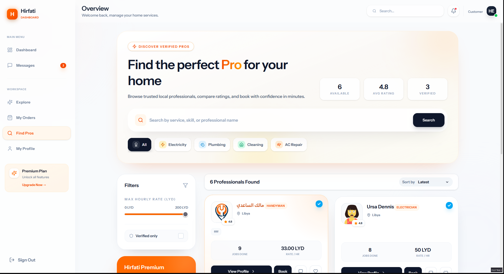
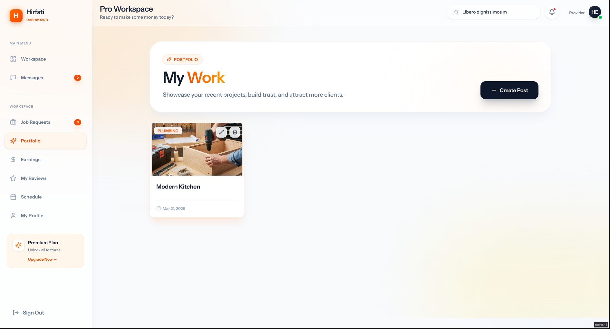
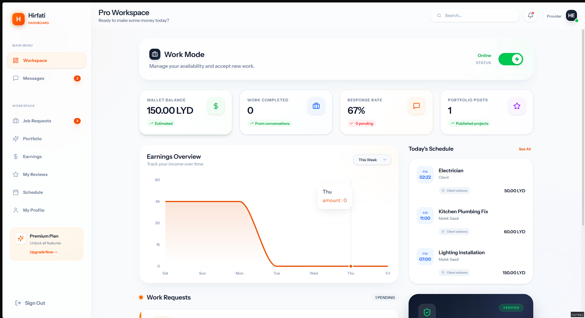
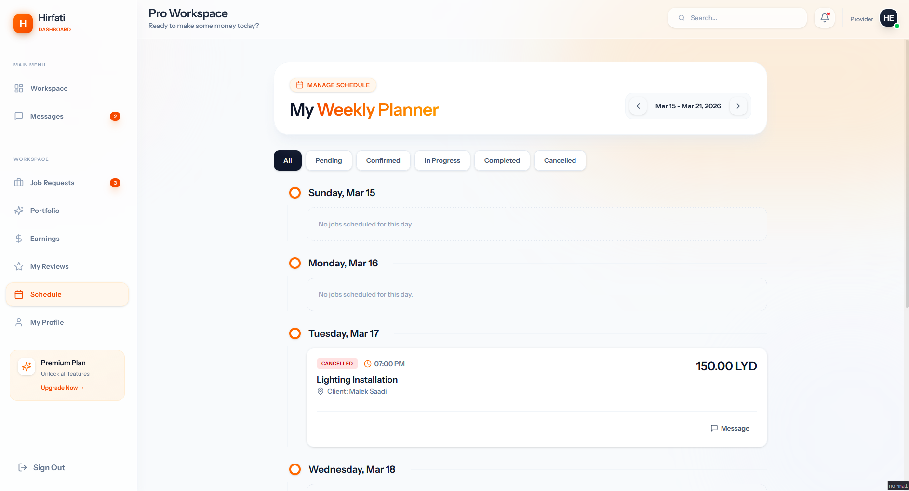
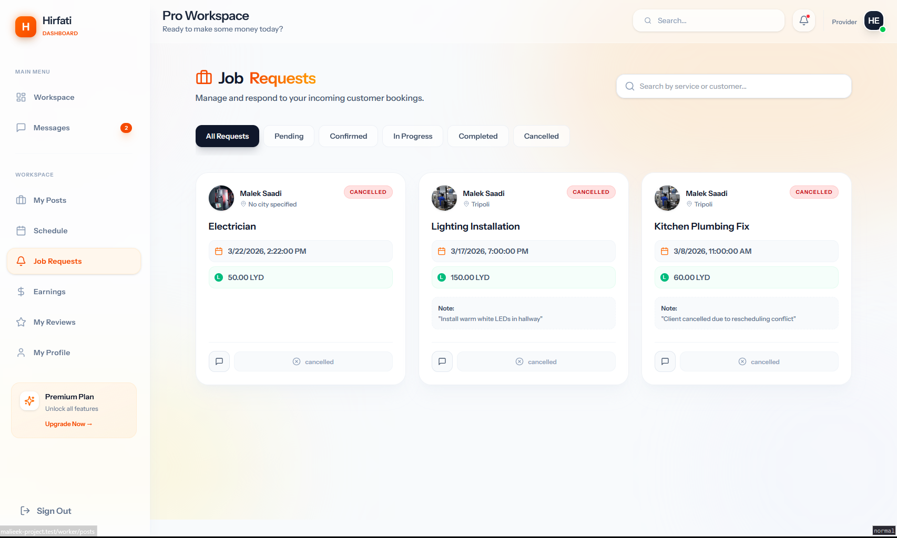
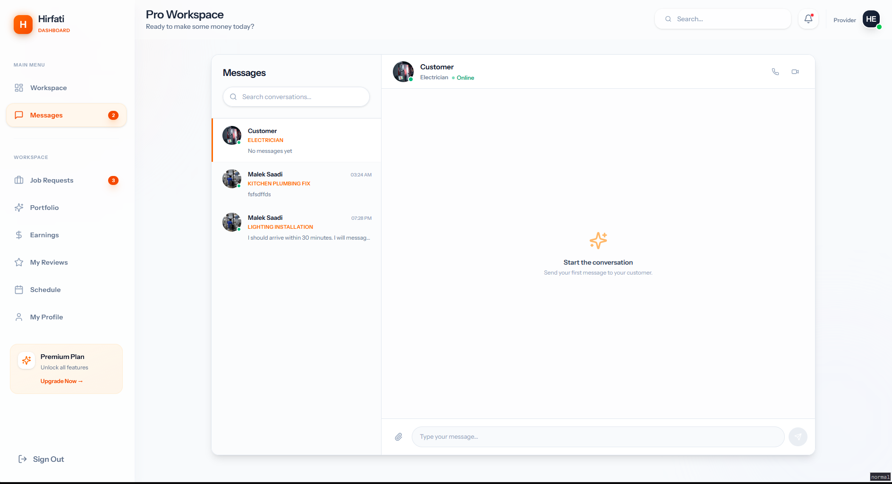
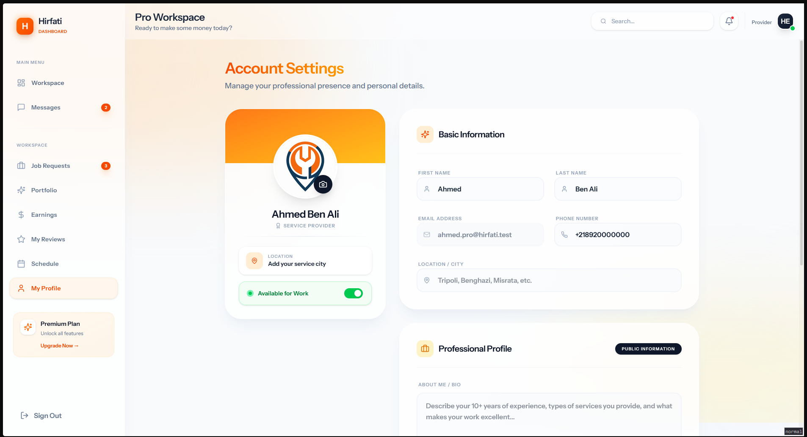
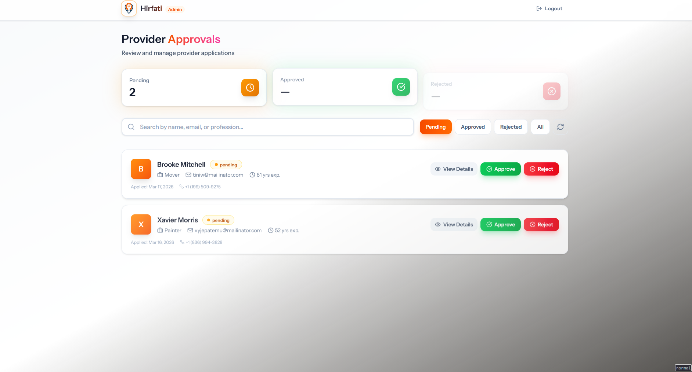
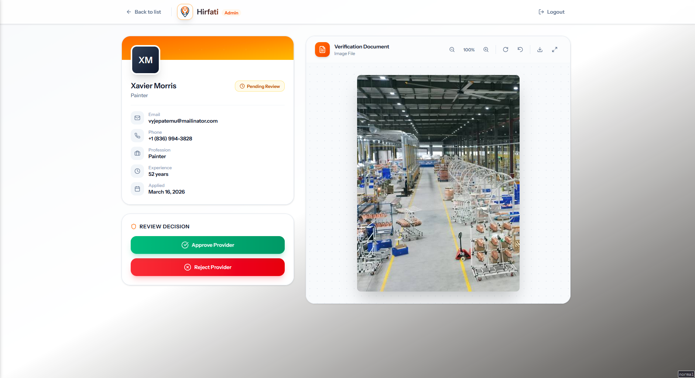

<div align="center">

# 🏗️ Hirfati — حرفتي

### **Premium Service Marketplace Platform**

*Connecting skilled professionals with customers who need expert help — fast, secure, and beautifully designed.*

[](https://laravel.com)
[](https://react.dev)
[](https://inertiajs.com)
[](https://tailwindcss.com)

</div>

---

## 📸 Screenshots

<div align="center">

### Landing & Discovery
| Find Providers | Provider Posts |
|:-:|:-:|
|  |  |

### Provider Dashboard
| Dashboard | Schedule | Job Requests |
|:-:|:-:|:-:|
|  |  |  |

### Communication & Profile
| Real-time Chat | User Profile |
|:-:|:-:|
|  |  |

### Admin Panel
| Admin Dashboard | Document Verification |
|:-:|:-:|
|  |  |

</div>

---

## ✨ Key Features

### 👤 For Customers
- **Smart Provider Discovery** — Search, filter, and browse verified professionals by location, skill, rating, and availability.
- **Booking System** — Book services with date/time scheduling, address selection, and budget estimation.
- **Order Tracking** — Real-time status updates from `pending` → `confirmed` → `in_progress` → `completed`.
- **Real-time Messaging** — Seamless in-app chat powered by Laravel Echo & Pusher.
- **Address Management** — Save and manage multiple service locations with map-based input.
- **Portfolio Browsing** — Explore provider portfolios with image galleries.

### 🔧 For Providers (Workers)
- **Professional Dashboard** — Comprehensive workspace with earnings summaries, recent activity, and quick actions.
- **Job Requests Management** — View, accept, decline, start, and complete incoming customer bookings.
- **Schedule View** — Day/week calendar view of all confirmed and upcoming jobs.
- **Portfolio / Posts** — Showcase completed work with image galleries to attract new customers.
- **Profile Management** — Full profile editor with skills, bio, hourly rates, and profile picture.
- **Address Management** — Set service areas and manage work locations.

### 🛡️ For Admins
- **Provider Approval Workflow** — Review applications, verify uploaded documents, approve or reject providers.
- **Craftsman Management** — View details for each provider, manage status, and monitor platform activity.

### 🏗️ Platform-wide
- **Multi-role Authentication** — Unified login supporting `customer`, `provider`, and `admin` roles.
- **Email Verification** — OTP-based email verification during registration.
- **Password Reset** — Secure code-based password recovery flow.
- **Two-Factor Auth** — Optional 2FA for enhanced account security.
- **Responsive Design** — Fully mobile-responsive UI with premium glassmorphism aesthetics.

---

## 🧰 Tech Stack

| Layer | Technology |
|-------|------------|
| **Backend** | Laravel 11 (PHP 8.2+) |
| **Frontend** | React 19 + TypeScript |
| **Bridge** | Inertia.js v2 (SPA-like, no API needed for pages) |
| **Styling** | Tailwind CSS 4 + Framer Motion animations |
| **UI Components** | Radix UI primitives + Lucide icons |
| **Real-time** | Laravel Echo + Pusher (WebSockets) |
| **Charts** | Recharts |
| **Build Tool** | Vite 7 |
| **Database** | MySQL |
| **Auth** | Laravel Sanctum + Fortify |
| **File Storage** | Laravel Storage (public disk) |

---

## 🚀 Getting Started

### Prerequisites
- **PHP** >= 8.2
- **Composer** >= 2.x
- **Node.js** >= 20.x
- **MySQL** >= 8.0
- **Laravel Herd** (recommended) or any local PHP server

### Installation

```bash
# 1. Clone the repository
git clone https://github.com/your-username/hirfati.git
cd hirfati

# 2. Install PHP dependencies
composer install

# 3. Install Node dependencies
npm install

# 4. Create environment file
cp .env.example .env

# 5. Generate application key
php artisan key:generate

# 6. Configure your database in .env
#    DB_DATABASE=hirfati
#    DB_USERNAME=root
#    DB_PASSWORD=

# 7. Run migrations and seed
php artisan migrate --seed

# 8. Create storage link
php artisan storage:link

# 9. Start development servers
npm run dev          # Vite dev server
php artisan serve    # Laravel server (if not using Herd)
```

### Creating an Admin User
```bash
php artisan app:create-admin
```

---

## 📁 Project Structure

```
hirfati/
├── app/
│   ├── Actions/              # Single-responsibility action classes
│   │   ├── Auth/             # Login, Register, Verify, Reset flows
│   │   ├── Fortify/          # User creation & password rules
│   │   └── Location/         # Geolocation & nearby provider logic
│   ├── Http/
│   │   ├── Controllers/
│   │   │   ├── Api/
│   │   │   │   ├── Admin/    # CraftsmanApprovalController
│   │   │   │   ├── Auth/     # Login, Register, Forgot Password, Email Verify
│   │   │   │   ├── Client/   # Orders, Addresses, Discovery, Dashboard
│   │   │   │   ├── Messages/ # Real-time chat controller
│   │   │   │   └── Provider/ # Dashboard, Posts, Schedule, Job Requests
│   │   │   └── Settings/     # Profile & Password settings
│   │   ├── Middleware/        # Role checks, Provider status gates
│   │   └── Requests/         # Form request validation classes
│   ├── Models/                # Eloquent models
│   │   ├── User.php           # Central user with role (customer/provider/admin)
│   │   ├── Customer.php       # Customer profile
│   │   ├── Provider.php       # Provider profile with approval status
│   │   ├── CustomerOrder.php  # Booking/order with status machine
│   │   ├── Message.php        # Chat messages
│   │   ├── ProviderPost.php   # Portfolio posts
│   │   └── ...
│   ├── Policies/              # Authorization policies
│   └── Traits/                # Shared traits (ApiResponses)
│
├── resources/js/
│   ├── pages/
│   │   ├── welcome.tsx        # Landing page
│   │   ├── auth/              # Login, Register, Forgot Password, OTP, 2FA
│   │   ├── client/            # Customer pages
│   │   │   ├── Dashboard.tsx  # Customer home dashboard
│   │   │   ├── FindPros.tsx   # Search & discover providers
│   │   │   ├── BookService.tsx# Service booking form
│   │   │   ├── MyOrders.tsx   # Order history & tracking
│   │   │   ├── Messages.tsx   # Real-time chat
│   │   │   ├── Profile.tsx    # Customer profile editor
│   │   │   └── ...
│   │   ├── worker/            # Provider pages
│   │   │   ├── Dashboard.tsx  # Provider workspace
│   │   │   ├── JobRequests.tsx# Manage incoming bookings
│   │   │   ├── Schedule.tsx   # Calendar schedule view
│   │   │   ├── MyPosts.tsx    # Portfolio management
│   │   │   ├── Messages.tsx   # Provider chat
│   │   │   ├── Profile.tsx    # Provider profile editor
│   │   │   └── ...
│   │   └── admin/             # Admin panel pages
│   ├── layouts/
│   │   └── DashboardLayout.tsx# Shared sidebar layout
│   └── components/            # Reusable UI components
│
├── routes/
│   ├── Auth/                  # Authentication routes
│   ├── Customer/              # Customer API + web routes
│   ├── Provider/              # Provider API + web routes
│   ├── Admin/                 # Admin routes
│   └── web.php                # Global web routes
│
├── database/
│   └── migrations/            # Database schema migrations
│
└── public/
    ├── screenshots/           # App screenshots for documentation
    └── storage -> ../storage/app/public  # Uploaded files symlink
```

---

## 🔐 Authentication & Roles

Hirfati implements a **unified multi-role authentication system**:

| Role | Access | Dashboard URL |
|------|--------|---------------|
| `customer` | Book services, chat, manage orders | `/client/dashboard` |
| `provider` | Manage jobs, portfolio, schedule | `/worker/dashboard` |
| `admin` | Approve providers, manage platform | `/admin/craftsmen` |

**Provider Lifecycle:**
```
Registration → Email Verification → Profile Completion → Admin Review → Approved / Rejected
```

Providers in `pending` status see a waiting screen. Rejected providers can resubmit their application.

---

## 📡 API Conventions

All API endpoints follow a consistent response structure using the `ApiResponses` trait:

```json
// Success
{
  "message": "Operation completed successfully.",
  "data": { ... }
}

// Error
{
  "message": "Validation failed.",
  "errors": { "field": ["Error message"] }
}
```

**Authentication:** All protected endpoints use `Bearer` tokens via Laravel Sanctum.

---

## 🧪 Development Scripts

```bash
npm run dev          # Start Vite dev server with HMR
npm run build        # Production build
npm run lint         # ESLint check & fix
npm run format       # Prettier formatting
npm run types        # TypeScript type check
```

---

## 📜 License

This project is proprietary software. All rights reserved.

---

<div align="center">

**Built with ❤️ by the Hirfati Team**

*Empowering craftsmen. Connecting communities.*

</div>
